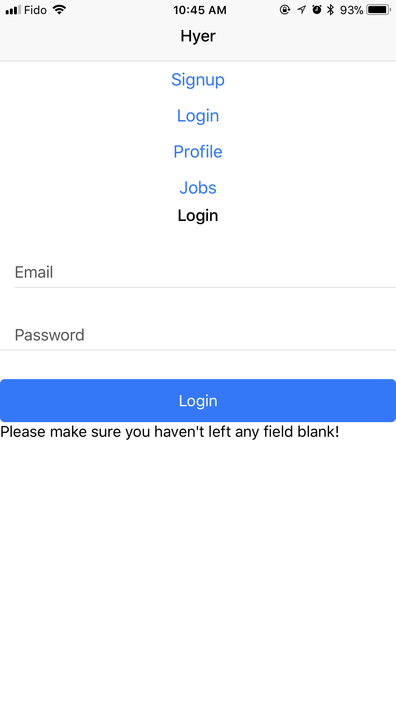
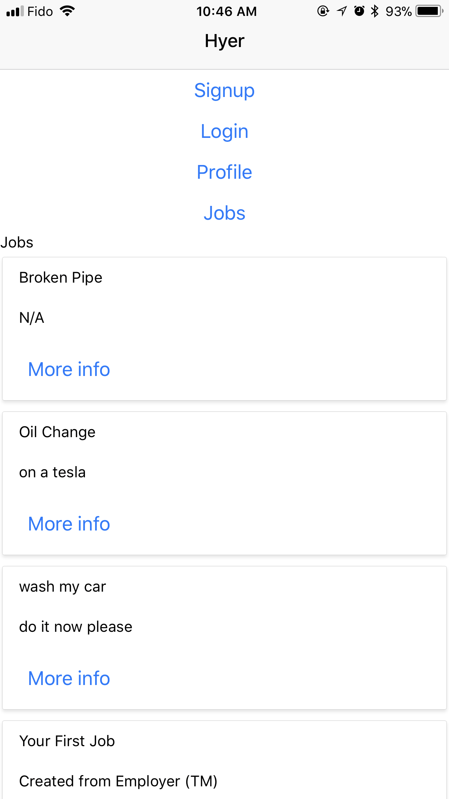
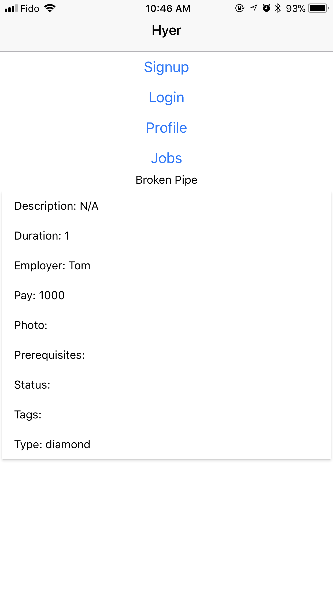

# Hyer Phase 2

## What was built
### Frontend
For the frontend side of the app, we managed to set up a React Native app based off the plan we made earlier in the previous phase. We did not make much changes from the last phase as we did spend a large amount of time planning and making sure there are no discrepancies in our app. We managed to create a simple login, signup, requests, profile, jobs views for our app. Much of our time was spent researching how to use newer technologies which we had no knowledge of initially. We also managed to display the list of jobs and thus create the "More info" job view which contains extra information about a specific job.

### Backend
For the backend side of the app, we set up a Firebase NoSQL database, to hold both users and jobs. We also set up an Express.js application for the server, handling HTTP requests, to different endpoints, to view, add, modify, or delete data in the database, for our frontend to use. For this deliverable we were able to complete enough, so that the most basic functionality can work on the frontend. In other words, we still can, and will, implement more endpoints for certain features of our app, however everything can currently work by calling multiple requests to modify the database. Certain additional features such as searching for jobs relative to our location were completed. Similar to the frontend, a lot of our time was used, learning how to use new things, which we have not used before, which slowed down our development process.

## What differed from our original plan
For this deliverable, our plan was to have a complete minimum viable product built, which would have included both applications complete, but with our lack of knowledge as a group, we ran into more obstacles than we had originally planned and are behind on schedule. Initially we planned to meet in person often to communicate what needs to be done, what is currently being worked on, and what is done. However, we decided that it would be much easier and less of a hassle to just communicate our progress through Slack. Communication through Slack was extremely efficient due to the fact that we are working in small teams and we split into smaller groups within the team (frontend and backend). Due to that, it was easy to keep track of progress.

## Teamwork reflection and process
### What went well:
* We generally had a very detailed and strong plan going into this phase, which we expressed strong confidence over as we took into account every technical challenge that we might face. We discussed technologies in great detail and agreed upon with confidence on how we are going to use such technologies in our overall project.
* Team generally co-operated well and there were little to no internal conflicts, which allowed us to be relatively productive.
* Communication during team meetings was generally very good, everyone brought in great ideas which allowed us to develop a full-proof plan of exactly how we plan to execute the project
* We created an interface that we would use to test our API throughout the development process. It assisted in detecting bugs and fixing them.

* The automated tested made sure no one on the backend team would commit code that would produce errors and bugs.

* The Kanban board allowed us to quickly see what needs to be worked on and who is working on what. Which greatly increased our efficency

### What did not go well:
* Communication outside team meetings needs significant improvement, some members are not able to hear announcements on time which ended up with them missing meetings.
* Some internal deadlines were missed which ended up with leaving us barely any time to test and generally gave the frontend team very little head-way to convert the backend API to its frontend interface.
* There were some communication issues when planning out the design for the API, it was not up to the standards as we wanted it to be. There was little communication from everyone else and the plan was implemented even though the endpoints needed to be changed/re-adjusted.

## Artifacts (App Screenshots)
#### Image 1: Main Login screen for Hyer

#### Image 2: Existing list of Jobs

#### Image 3: Upon clicking "More info", the user is taken to this screen where they are able to view the job in more detail

#### `/screenshots` directory
Along with these we also have other screenshots of the app inside the screenshots directory. Generally speaking, each PNG file should correspond to a view on the main app.
* `login.PNG` 
* `signup.PNG` 
* `jobs.PNG` - The Jobs view where a list of all available jobs should be displayed.
* `detailed_job.PNG` - A detailed view of a given job. Includes more information like Pay, Type, Location, etc.
* `phone_auth.PNG` - Screen 1 of the Phone auth system where a text is sent out to the number provided and validation is done to make sure its valid.
* `phone_auth2.PNG` - Screen 2 of the Phone auth system where space is provided to enter the code from the text message that was just sent out to the user. The user then has the option to enter the code and if correct it is taken to the next screen the profile page
* `profile.PNG` - Profile of a user, includes a simple Bio, first name, last name and age. Profile picture image functionality to be added in the next phase.

## Technical highlights
### Frontend
As a beginner user of React Native, Shrey who was working primarily on the frontend and generally found it harder to completely understand its workflow. Though the learning curve was slightly challenging, it was not as difficult to develop a simple prototype and visualize everything.
  
A major bug that slowed down our progress was related to the use of states and props. Specifically for the Jobs view, since everything was being loaded as an array, the best way we thought to store it was through a state. Unfortunately, since that was not allowed, another alternative would be to set it part of the React Object itself. This turned out to be the better solution as it allowed us to access the variable effectively. In addition since the state was being called from React's render method itself, that needed to be put in a separate method without the React Component itself.
A minor issue occured when requesting POST from React Native app using backend API, where backend recieve an empty body object. The bug was not present during backend development/testing since the issue is unique to fetch method, which was used solely by the frontend.

### Backend
With our whole team being new to firebase, it took some time getting used to how to use the realtime database. One of the biggest problems was that we simply could not fetch child nodes from firebase due to it being asynchronous, and somebody could be updating the exact child at the exact time, causing errors. Therefore we had to use a snapshot of the database before fetching data. Finding out when to create the snapshot, and how to access data, was troublesome and took us an excessive amount of time figuring out. Additionally, with some members being completely new to JavaScript this semester, and others not being used to it's asynchronous nature, and working with callbacks, it posed some time to get used to. Another shortcut, we used was that since HTML forms do not support PUT, and DELETE, and having trouble with Jquery's AJAX, we used a POST request to a separate endpoint for these types of requests. In general our backend team has learned a significant amount on Express.js, and Firebase.

## Our plan for the future
### Frontend
We hope to have all the frontend styling completely finished with a Google Maps interface on both the Employer and Employee apps which should show the location of all employees/employers in their corresponding apps. We also hope to have the job requests functions finished upon feedback from the backend team. As these two features will be our primary focus in this phase, we also hope to have completed the following as outlined in the previous phase:
1. Any form validation needed on the various different views (Login/Signup etc.)
2. A Frontend interface for the wallet system to add/subtract values, integrated with Stripe in the backend
3. Phone and email authentication fully working.
4. Timer system to check the amount of time the employee spends at the job and gets paid automatically through the wallet as soon as both sides stop the timer
5. Ratings interface implemented with the API, clearly visible through the profile

### Backend
We hope to implement additional endpoints for the frontend to work with more easily, and so that we can support more features. Since we mostly figured things out, we know that this time around, we will not run into as many problems that take so much time to figure out ourselves, and can implement these with much higher efficiency. These additional features include:
1. Payments (starting off with transfering in-app currency, and later with Stripe/Paypal)
2. Accepting requests directly in the app, with there not needing third-party communication (booleans and assigninment to jobs)
3. More location based selection (Google Maps)
4. Ratings system for the users of the app.
5. Query for jobs
